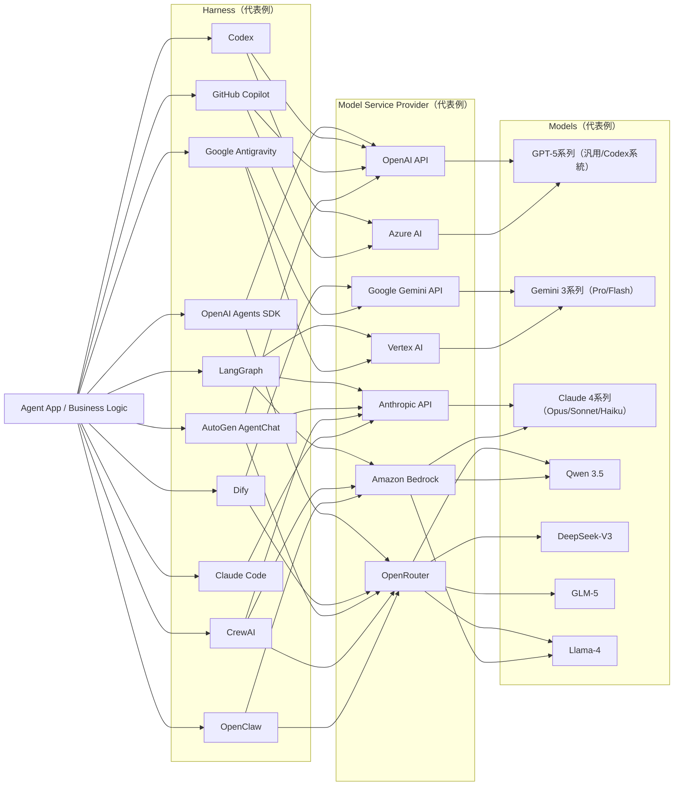

# 2026年現在のAIエージェントにおける接続関係（ハーネス・モデルサービスプロバイダ・モデル）

2026年3月1日時点での整理です。
（用語）`ハーネス` = エージェント実行基盤/オーケストレーション層、`モデルサービスプロバイダ` = API提供者、`モデル` = 実際に推論するLLM本体。

## 著名な例と特徴

### 1. ハーネス（実行基盤）

| ハーネス | 主な操作形態 | 実行基盤 | 完全自立対応 | 主な利用モデル | 利用者目線の補足 |
|---------|------------|---------|------------|--------------|----------------|
| OpenAI Agents SDK | SDK型 | サーバ型/ローカル型 | はい | GPT-5系列 | API中心でアプリへ組み込みやすく、handoff/manager型のマルチエージェント設計が可能 |
| LangGraph | SDK型 | サーバ型 | はい | 全モデル汎用 | 永続化チェックポイント前提のdurable executionが強み。停止・再開・HITLに向く |
| Dify | GUI型 | サーバ型 | はい | OpenRouter経由で多様 | ノーコード/ローコードでLLMアプリ/エージェントを素早く構築。ワークフロー・ナレッジ統合 |
| Codex | CLI型 | ローカル型/クラウド型 | 一部対応 | GPT-5.3-Codex | コーディング用途に最適化。コード編集・実行・検証のループを短く回しやすい |
| GitHub Copilot | IDE型 | クラウド型 | 一部対応 | GPT-5系列/Azure経由 | IDE/CLI統合が強く、補完・チャット・編集提案を開発フローに自然に組み込める |
| Google Antigravity | IDE型 | ローカル型/クラウド型 | 一部対応 | Gemini 3系列 | エージェント駆動の開発・自動化に焦点。複数モデルを用途別に使い分け可能 |
| AutoGen AgentChat | SDK型 | サーバ型 | はい | 全モデル汎用 | 高レベルAPIでマルチエージェントを組みやすく、下層`autogen-core`でイベント駆動に |
| CrewAI | SDK型 | サーバ型 | はい | Claude/OpenRouter優先 | crews/flows中心、guardrails・memory・observabilityを最初から組み込みやすい |
| Claude Code | CLI型 | ローカル型/クラウド型 | 一部対応 | Claude 4系列 | ターミナル内での実装作業に強く、リポジトリ読解から修正まで一貫して進めやすい |
| OpenClaw | CLI型 | ローカル型 | 一部対応 | OpenRouter/Bedrock経由 | OSSベースで柔軟に拡張しやすく、端末操作フローに馴染みやすい |

### 2. モデルサービスプロバイダ（API提供者）

| プロバイダ | 提供モデル | 特徴 |
|-----------|-----------|------|
| OpenAI API | GPT-5系列 | 関数呼び出し/構造化出力などエージェント向け機能が厚い |
| Anthropic API | Claude 4系列 | Opus/Sonnet/Haikuの性能帯が明確、長文コンテキスト運用がしやすい |
| Google Gemini API | Gemini 3系列 | 推論重視のProと低コスト高速のFlashを分けて選びやすい |
| OpenRouter | 全主要モデル | 複数ベンダーのモデルを単一APIでルーティングできる集約レイヤー |
| Azure AI | GPT-5系列中心 | Azure上でOpenAI系を含むモデル提供・運用統合がしやすい |
| Vertex AI | Gemini 3系列中心 | Google Cloud上でGeminiを中心にモデル利用とMLOpsを統合 |
| Amazon Bedrock | Claude/LLama/Qwen等 | 単一AWS窓口で複数社モデルを扱える集約プロバイダ |

### 3. モデル（代表）

| モデル系列 | 代表バージョン | 特徴・用途 |
|----------|--------------|-----------|
| GPT-5系列 | GPT-5.2 / GPT-5.3-Codex | 汎用/コーディング特化で系統分離 |
| Claude 4系列 | Opus 4.6 / Sonnet 4.5 / Haiku 4.5 | 知能-速度-コストの階層が明確 |
| Gemini 3系列 | 3.1 Pro / 3.0 Flash | 複雑推論と高速低コストを分離 |
| Qwen 3.5 | Qwen3.5-72B / 32B | 多言語・実用タスクで広く採用 |
| DeepSeek-V3 | DeepSeek-V3.2 | コーディングや推論系ワークロードで採用 |
| GLM-5 | GLM-5-130B | 中英多言語用途で選択肢 |
| Llama-4 | Llama-4-405B / 70B | オープン系の事実上の標準、各社でホスト |

## 参照（公式）

- OpenAI Agents SDK: https://openai.github.io/openai-agents-python/
- LangGraph Durable Execution: https://langchain-ai.github.io/langgraph/concepts/durable_execution/
- AutoGen AgentChat: https://microsoft.github.io/autogen/stable/user-guide/agentchat-user-guide/
- CrewAI Docs: https://docs.crewai.com/
- OpenAI Models: https://platform.openai.com/docs/models
- Anthropic Claude models: https://docs.anthropic.com/en/docs/about-claude/models
- Gemini models: https://ai.google.dev/gemini-api/docs/models
- Bedrock supported models: https://docs.aws.amazon.com/bedrock/latest/userguide/models-supported.html
- OpenRouter Models: https://openrouter.ai/docs/models