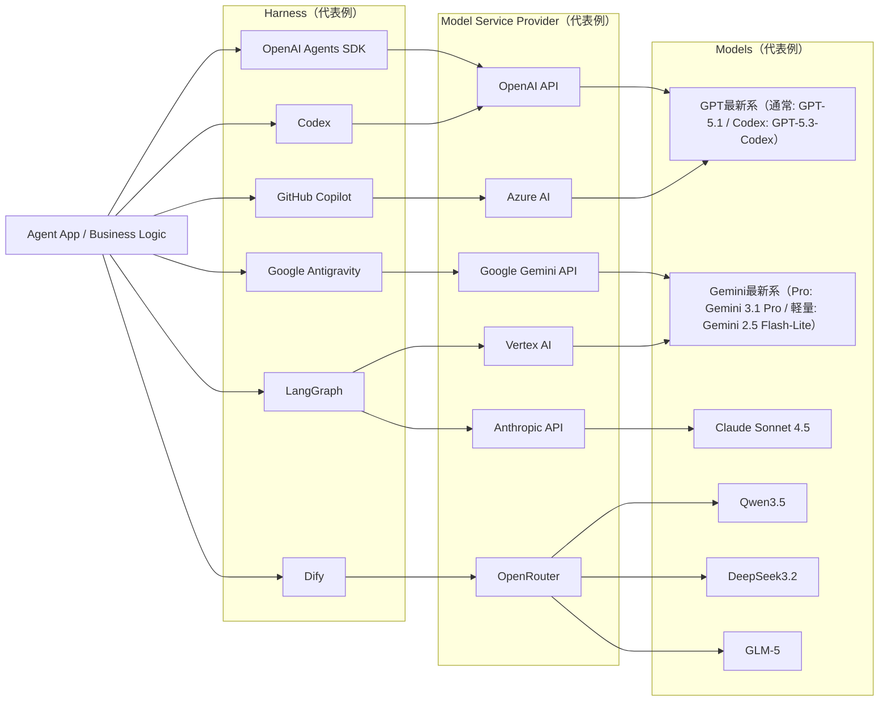

# 2026年現在のAIエージェントにおける接続関係（ハーネス・モデルサービスプロバイダ・モデル）

2026年3月1日時点での整理です。
（用語）`ハーネス` = エージェント実行基盤/オーケストレーション層、`モデルサービスプロバイダ` = API提供者、`モデル` = 実際に推論するLLM本体。

## 著名な例と特徴

### 1. ハーネス（実行基盤）

1. **OpenAI Agents SDK**: エージェントを「モデル+instructions+tools(+MCP)」として構成し、handoff/manager型のマルチエージェント設計がしやすい。
2. **Codex**: コーディング用途に最適化されたエージェント実行環境。コード編集・実行・検証のループを短く回しやすい。
3. **Claude Code**: ターミナル内で動作し、コードベースの読み取りからファイル編集、コマンド実行までを一貫して行うエージェントです。Gitと直接連携し、変更のステージングやコミット、PRの作成まで自律的に支援します。
4. **Claude Cowork**: 非エンジニア向けに提供されたClaude Desktopアプリ内の機能です。ターミナルを使わずに、ユーザーが許可したローカルフォルダへ直接アクセスし、自律的にマルチステップのファイル整理やデータ抽出を行います。
5. **Google Antigravity**: 単なるIDEではなく、AIエージェントの自律的な計画や実行を管理する「オープンエージェントマネージャー」プラットフォームです。  エディタ、ターミナル、ブラウザを横断してタスクを実行し、Request Review・Auto・Turboといった権限レベルで人間が承認プロセスを管理できます。
6. **AutoGen AgentChat**: 高レベルAPIでマルチエージェントを組みやすく、下層`autogen-core`でイベント駆動に落とせる。
7. **GitHub Copilot**: IDE/CLI統合が強く、補完・チャット・編集提案を開発フローに自然に組み込める。
8. **CrewAI**: crews/flows中心で、guardrails・memory・observabilityを最初から組み込みやすい。
9. **Dify**: GUI中心でLLMアプリ/エージェントを素早く構築しやすい。ワークフロー・ナレッジ・運用機能がまとまっている。
10. **LangGraph**: 永続化チェックポイントを前提にした durable execution が強み。停止・再開・HITLに向く。
11. **OpenClaw**: DiscordやSlackなどをフロントエンドとして利用できる、常駐型のオープンソースエージェントフレームワークです。AIの振る舞いやルールを `SOUL.md` や `AGENTS.md` といったマークダウンファイルで定義し、PC操作からスマートホーム機器の制御まで幅広く自動化できます。

| ハーネス | 主な操作形態 | 実行基盤 | 完全自立対応 | 利用者目線の補足 |
| --- | --- | --- | --- | --- |
| OpenAI Agents SDK | SDK型 | サーバ型 | はい | API中心でアプリへ組み込みやすい |
| Codex | CLI型 | ローカル/クラウド | 一部対応 | 実装・修正・検証の開発ループ向け |
| Claude Code | CLI型 | ローカル/クラウド | 一部対応 | リポジトリ作業を対話とコマンドで自律的に進めやすい |
| Claude Cowork | デスクトップアプリ型 | ローカルPCアクセス | 一部対応 | 非エンジニアでもローカルファイルの自動処理を依頼しやすい |
| Google Antigravity | エージェントマネージャー型 | ローカル型 | 一部対応（Auto/Turbo等） | 実行状況を可視化・承認（HITL）しながら進めるプラットフォーム |
| AutoGen AgentChat | SDK型 | サーバ型 | はい | マルチエージェント実験から本番まで展開しやすい |
| GitHub Copilot | IDE型 | ローカル/クラウド | 一部対応 | 開発者作業への常時支援に向く |
| CrewAI | SDK型 | サーバ型 | はい | 役割分担型エージェント設計がしやすい |
| Dify | GUI型 | サーバ型 | はい | ノーコード/ローコードで立ち上げやすい |
| LangGraph | SDK型 | サーバ型 | はい | 状態管理・停止再開・承認フローに強い |
| OpenClaw | チャットUI（Slack等） / 常駐型 | ローカル/サーバ型 | はい | マークダウンでAIのルールを定義し、様々なタスクを自動化・連携しやすい |

### 2. モデルサービスプロバイダ（API提供者）

1. **Amazon Bedrock**: 単一のAWS窓口で複数社モデルを扱える「集約プロバイダ」型。
2. **Azure AI**: Azure上でOpenAI系を含むモデル提供・運用統合がしやすい。
3. **Google Gemini API**: 2.5 Pro/Flash-Liteなど、推論重視と低コスト高速を分けて選びやすい。
4. **Vertex AI**: Google Cloud上でGeminiを中心にモデル利用とMLOpsを統合しやすい。
5. **OpenAI API**: GPT-5系を中心に、関数呼び出し/構造化出力などエージェント向け機能が厚い。
6. **Anthropic API**: Claude 4.x系の性能帯が明確で、長文コンテキスト運用やComputer Useに強い。
7. **OpenRouter**: 複数ベンダーのモデルを単一APIでルーティングできる集約レイヤー。

### 3. モデル（代表）

1. **GPT-5.2 / GPT-5.3-Codex**: 用途別に系統を分けた最新構成。
2. **Claude Opus 4.6 / Sonnet 4.5 / Haiku 4.5**: 知能-速度-コストの階層が明確。
3. **Gemini 3.1 Pro / Gemini 3.0 Flash**: 複雑タスクと高速・低コスト用途を分けて選びやすい。
4. **Qwen3.5**: 多言語・実用タスクで使われることが多いモデル系列。
5. **DeepSeek-V3.2**: コーディングや推論系ワークロードで採用されることがあるモデル系列。
6. **GLM-5**: 中国語・英語を含む多言語用途で選択肢になりやすいモデル系列。
