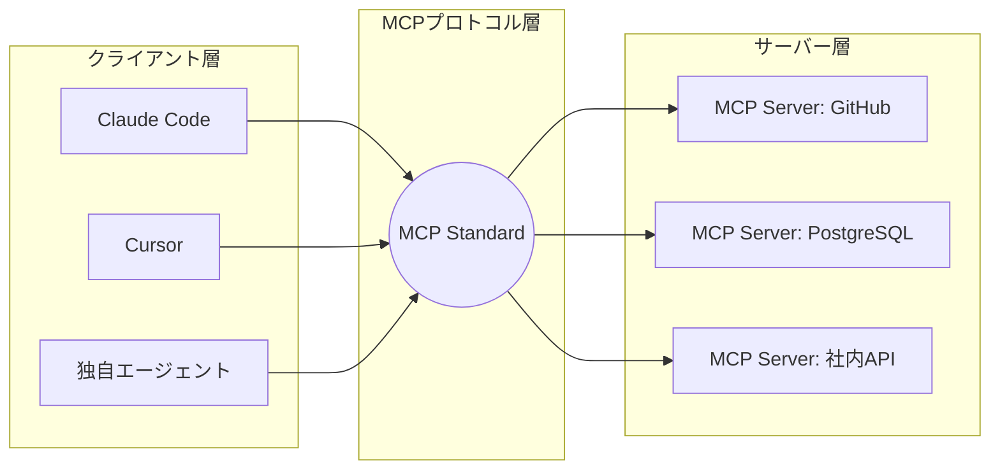

# MCP (Model Context Protocol) による標準化されたツール連携

## 1. 概要と概念

**Model Context Protocol (MCP)** は、AIエージェントと外部データソース（データベース、SaaS API、ローカルファイル等）を安全かつ標準化された方法で接続するためのオープンプロトコルです。Anthropicによって提唱され、2025年後半にかけて業界標準となりました。

「AIエージェント向けのUSB規格」と表現されることも多く、MCPに対応したクライアント（Claude Code, Cursor等）と、MCPに対応したサーバーが双方向に通信することで、AIはあらゆるシステムと統合できます。

### なぜ MCP が重要なのか？

以前は、AIエージェントごとに特定のツール（GitHub連携、PostgreSQL連携など）を使用するための専用コード（独自実装）を書く必要がありました。MCPの登場により、「一度MCPサーバーを作れば、どのMCP対応AIクライアントからでも利用できる」エコシステムが完成しました。

これにより、2026年には「エージェント自体を作る」のではなく、「企業の独自データシステムをMCPサーバーとして公開し、汎用エージェントに繋ぐ」ことがエンタープライズAIのメインストリームとなっています。

## 2. アーキテクチャ図解



## 3. ハンズオン：最もシンプルなMCPサーバーの実装

Node.jsを使って、ローカルの特定のディレクトリのファイル一覧と中身をAIに提供し、操作させる自作のMCPサーバーを実装する手順です。

### Step 1: 依存関係のインストール

```bash
mkdir my-mcp-server
cd my-mcp-server
npm init -y
npm install @modelcontextprotocol/sdk zod
```

### Step 2: サーバーコードの実装

`index.mjs` を作成し、AIに公開する「ツール」を定義します。

```javascript
// index.mjs
import { McpServer } from "@modelcontextprotocol/sdk/server/mcp.js";
import { StdioServerTransport } from "@modelcontextprotocol/sdk/server/stdio.js";
import { z } from "zod";
import * as fs from "fs/promises";

// 1. MCPサーバーのインスタンスを作成
const server = new McpServer({
  name: "simple-file-manager",
  version: "1.0.0",
});

// 2. AIが呼び出せる「ツール」を定義: ファイル内容の読み取り
server.tool(
  "read_file",
  "指定したファイルの内容を読み取ります",
  {
    filePath: z.string().describe("読み取るファイルの絶対パスまたは相対パス"),
  },
  async ({ filePath }) => {
    try {
      const content = await fs.readFile(filePath, "utf-8");
      return {
        content: [{ type: "text", text: content }],
      };
    } catch (err) {
      return {
        content: [{ type: "text", text: `エラー: ${err.message}` }],
        isError: true,
      };
    }
  }
);

// 3. ツール: ファイルの作成・上書き
server.tool(
  "write_file",
  "ファイルに文字列を書き込みます",
  {
    filePath: z.string().describe("書き込み先のファイルパス"),
    content: z.string().describe("書き込む内容"),
  },
  async ({ filePath, content }) => {
    try {
      await fs.writeFile(filePath, content, "utf-8");
      return {
        content: [{ type: "text", text: `${filePath} への書き込みに成功しました。` }],
      };
    } catch (err) {
      return {
        content: [{ type: "text", text: `エラー: ${err.message}` }],
        isError: true,
      };
    }
  }
);

// 4. 標準入出力（stdio）を使ってサーバーを起動
// AIクライアントとプロセス間通信でやり取りします
const transport = new StdioServerTransport();
await server.connect(transport);
```

### Step 3: MCPクライアント（AI側）への登録

Claude Codeなど、MCP対応のクライアントにこのサーバーを認識させます。（以下は設定ファイルの一例です）

```json
{
  "mcpServers": {
    "my-file-manager": {
      "command": "node",
      "args": ["/absolute/path/to/my-mcp-server/index.mjs"]
    }
  }
}
```

これで、AIエージェントに「`sample.txt`を読んで、要約を`summary.txt`に書いて」と指示すると、エージェントは自律的に `read_file` ツールと `write_file` ツールを呼び出してタスクを完了します。

## 4. MCP の発展系（MCP Apps等）

2026年にかけて、MCPは単にテキストのやり取りをするだけでなく、AIへの返答として**インタラクティブなUIコンポーネント**（チャートやダッシュボード）を返す `MCP Apps` の概念も導入されました。これにより、AIシステムはより直感的なデータの可視化や操作をユーザーに提供できるようになっています。
