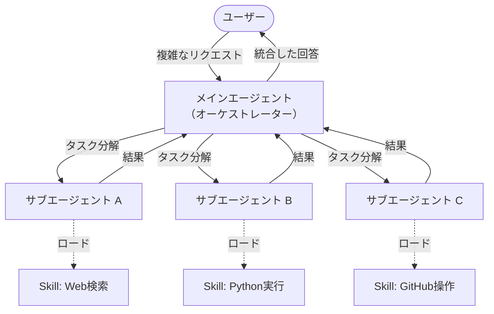

# Skills と Subagent による階層型タスク実行

## 1. 概要と概念

2026年のAIエージェント開発において最も重要な設計パラダイムの一つが、「Skills（スキル）」と「Subagent（サブエージェント）」を用いた階層型のタスク実行アーキテクチャです。

*   **メインコンテキストの保護**: メインのAI（エージェント）が大規模なコードの全体像を把握しつつ、「このファイルのリファクタリングだけやっておいて」とサブエージェントに投げます。サブエージェントの試行錯誤（失敗のログなど）はメインのコンテキストを汚染しません。
*   **並列処理（Parallel Execution）**: 複数のサブエージェントを同時に走らせることで、「フロントエンドの修正」と「バックエンドの修正」を並行して行わせ、作業時間を大幅に短縮できます。
*   **権限のスコープ化（最小特権の原則）**: サブエージェントごとに利用可能なツール（権限）を制限できます。例えば、「テスト実行専用サブエージェント」にはシェルコマンドの権限を与えるが、「コードレビュー専用」にはファイルの読み取り権限しか与えないといった運用により、暴走時の被害を極小化できます。
*   **入力と出力の契約化**: 何をインプットとして受け取り、何をアウトプットとして返すのかをツール呼び出しのように明確（Contract化）にすることで、エージェント間の連携が安定します。
*   **サブエージェントの永続メモリ**: 一部の高度なサブエージェントは自分専用の記憶（永続メモリ）を持ち、過去にレビューで指摘した事項などを蓄積・活用できるようになります。

## 2. Skills (スキル) とは？

**Skills** は、エージェントやサブエージェントに与える「得意技（Promptとルールのセット）」です。
「あなたはセキュリティ専門家です」というシステムプロンプトと、特定のルールセット、チェックリストなどをパッケージ化したものを指します。

2026年においては、Skillsは巨大な1つのプロンプトにまとめるのではなく、以下のような特徴を持ちます。

*   **実行時オンデマンドローディング**: 必要なタスクの時だけ、関連するSkillがメモリ空間に呼び出されます（不要になれば破棄される）。
*   **Skill Hot-Reloading**: エージェントを再起動することなく、Skillの定義（プロンプトやスクリプト）を編集して即座に反映・評価する運用が可能です。
*   **パッケージ化**: 複数のシステムプロンプト、評価用スクリプトファイルなどの「Artifacts」をまとめて1つの `Skill` として配布・再利用できます。
*   **Subagent (サブエージェント)**: メインのエージェント（オーケストレーター）から生成される、特定の単一タスクに特化した使い捨ての子エージェントです。

メインのエージェントは複雑なタスクを受け取ると、それを小さなステップに分解し、各ステップに必要な**Skill**を持たせた**Subagent**をスポーン（生成）します。Subagentはタスクを非同期に実行し、結果をメインエージェントに返して消滅します。これにより、コンテキストウィンドウの節約、ハルシネーションの低減、および並列処理による高速化が実現されます。

## 3. 各種AIツールにおける Skills と サブエージェント のサポート状況（2026年時点）

2026年現在、各主要AIコーディングアシスタントは巨大なプロンプトの限界を克服するため、何らかの形で「特定の専門知識（Skill）」と「並列ワーカー（Subagent）」の概念をサポートしています。

| AI ツール (2026年) | Skills / サブエージェントの対応と特徴 |
| :--- | :--- |
| **Claude Code** | **ネイティブサポート**。<br>`~/.claude/skills/` 以下に配置した `SKILL.md` を `/skill-name` コマンドで動的に読み込み。Agent SDKを通じて、`context: fork` を用いた完全なコンテキスト分離型のサブエージェント（並列実行）をサポート。 |
| **Codex** | **ネイティブサポート**（実行業務ユニットとして）。<br>プロンプトに加え、`scripts/` や `templates/` を同梱した独立パッケージとしての Skill を定義し、CLIパイプラインの中で並列ワーカーとして実行可能。 |
| **Antigravity** (Gemini) | **アーキテクチャレベルでの統合**。<br>ユーザーのコンテキストを理解する「KNOWLEDGE SUBAGENT」や、独立した「ブラウザ操作専用サブエージェント」などが自律的に背後でスポーンし、メインエージェントを支援するアーキテクチャ。Skillは専門的な `.md` 指示ファイルとして `view_file` 経由でオンデマンド認識される。 |
| **GitHub Copilot** | **機能拡充中（@メンション拡張として）**。<br>`@workspace` や `@vscode` などのビルトインエージェントの他、カスタムなVS Code拡張（Extension）やMCPサーバーを作ることで、特定のSkill（例：`@my-company-linter`）を持ったサブエージェントとしてチャットに呼び出すアプローチ。 |

## 4. アーキテクチャ図解



## 5. ハンズオン：実践的な Skill と Subagent の構築

ここでは、2026年現在の業界標準である「ファイル定義ベース・オンデマンド実行」を用いた具体的な組み込み手順を解説します。擬似コードではなく、最新のAgent SDKやCLI環境で使われる実際のファイル構造とコマンドに基づいています。

### ステップ 1: Skill の定義と配置

スキルは単なるプロンプトではなく、「メタデータ＋指示内容＋コンテキスト分離設定」のセットとして定義し、特定のディレクトリに配置します。

```bash
# 1. プロジェクト内にカスタムスキル用のディレクトリを作成
mkdir -p .agents/skills/security-audit/artifacts

# 2. スキルの本体である SKILL.md を作成
cat > .agents/skills/security-audit/SKILL.md << 'EOF'
---
name: security-audit
version: "1.0.0"
description: "対象ファイルのセキュリティ脆弱性（OWASP Top 10等）をチェックする"
context: fork          # 独立したコンテキストで実行し、メインを汚染しない
tools: [Read, Grep]    # 最小特権：読み取りのみ許可
---

# セキュリティ監査ルール

あなたはセキュリティエンジニアです。以下の観点でコードをレビューしてください。
1. SQLインジェクション
2. XSS (クロスサイトスクリプティング)
3. 認証情報のハードコード

結果は見出しを用いて、Critical/High/Mediumの3段階で指摘してください。
EOF
```

### ステップ 2: Subagent の設定定義（YAML）

次に、特定の役割に特化し、特定のスキルをデフォルトで活用できる「Subagent」の設定（YAML）を定義します。

```bash
mkdir -p .agents/subagents

cat > .agents/subagents/security-reviewer.yaml << 'EOF'
name: security-reviewer
description: >
  コードのセキュリティ監査を担当する。
  疑わしい変更があれば分析し、結果をメインエージェントに返す。
system_prompt: |
  あなたはコード監査専門のサブエージェントです。
  必ず `security-audit` スキルを活用して分析を行い、
  危険度を判定して人間またはメインエージェントに返答してください。
allowed_tools:
  - Read
  - Grep
memory: .agents/memory/security-reviewer/ # 過去の指摘を永続的に記憶する
EOF
```

### ステップ 3: 実際の実行と呼び出し

開発環境（CLIやSDK）では、これらの定義ファイルを自動で読み込みます。開発者がチャットUIやターミナル（メインエージェント）から指示を出すと、以下のように Subagent が呼び出されます。

**CLIインタラクティブモードからの呼び出し例：**
```
ユーザー: /security-reviewer を使って src/auth.ts を監査して
```

**Agent SDKを用いたプログラムからの並列呼び出し例（Python）：**
```python
import anthropic
from anthropic.agent_sdk import AgentSession

# SDKを用いてメインセッション（オーケストレーター）を起動
client = anthropic.Anthropic()
session = AgentSession(client=client, model="claude-opus-4-6")

# 設定ファイルを読み込んでサブエージェントをロード
sec_reviewer = agent_sdk.load_subagent_config(".agents/subagents/security-reviewer.yaml")
perf_analyzer = agent_sdk.load_subagent_config(".agents/subagents/perf-analyzer.yaml")

# 並列実行：セキュリティ監査とパフォーマンス分析を同時にサブエージェントに投げる
results = session.run_subagents_parallel([
    {
        "agent": sec_reviewer,
        "task": "src/auth.ts のパスワードハッシュ化部分を security-audit スキルで監査"
    },
    {
        "agent": perf_analyzer,
        "task": "src/ ディレクトリ全体のN+1クエリをチェック"
    }
])

# サブエージェントからの結果表示（メインのコンテキストは保護されたまま）
for res in results:
    print(res.output)
```

このように、ファイルを分けて「権限」「メモリ」「コンテキストの分岐(fork)」を明確に契約（Contract）化し、SDKから並列に呼び出すのが、2026年以降の実践的なエージェント開発の基本手順です。

## 6. なぜこのアプローチが重要なのか？

1.  **ステートの分離**: サブエージェントがクラッシュしたりハルシネーションを起こしても、メインエージェントに波及しません。
2.  **認知的負荷の低減**: 各サブエージェントのシステムプロンプトは非常にシンプルになり、LLMが指示通りに動きやすくなります。
3.  **再利用性と拡張性**: 新しいツールを導入する際は、新しいSkillクラスを作り、それを扱えるSubagentを定義するだけで済みます。既存のメインエージェントのプロンプトを書き換える必要がありません。
