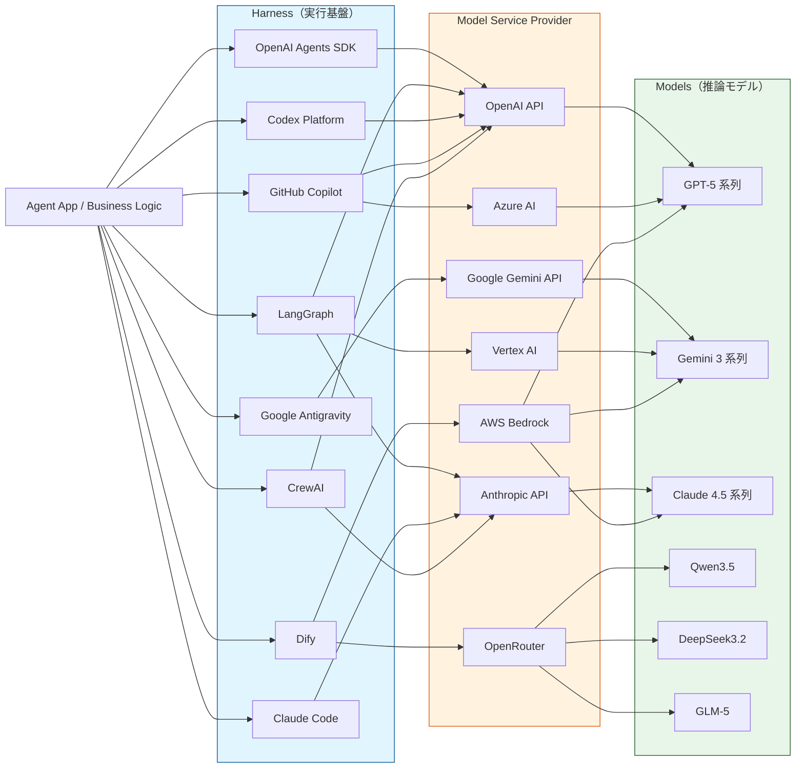

# 2026 年 AI エージェント生態系マップ（接続関係・層別整理）

**作成日**: 2026 年 3 月 1 日時点
**用途**: AI エージェントにおける接続関係（ハーネス・モデルサービスプロバイダ・モデル）の整理

## 1. 用語定義
- **ハーネス (Harness)**: エージェント実行基盤 / オーケストレーション層（SDK、IDE、プラットフォーム等）
- **モデルサービスプロバイダ (Provider)**: API 提供者 / インフラ層
- **モデル (Model)**: 実際に推論を行う LLM 本体

## 2. 生態系フローチャート

> **注釈**: ハーネスとプロバイダの接続線は主要な構成例を示しており、実際には多くのハーネスが複数プロバイダを柔軟に選択可能です（多対多の関係）。

## 3. 著名な例と特徴

### 3.1 ハーネス（実行基盤）
| ハーネス | 主な操作形態 | 実行基盤 | 完全自立対応 | 利用者目線の補足 |
| :--- | :--- | :--- | :--- | :--- |
| **OpenAI Agents SDK** | SDK 型 | サーバ型 | はい | API 中心でアプリへ組み込みやすい。handoff/manager 型マルチエージェント設計に強み。 |
| **Codex Platform** | CLI/IDE 型 | ローカル/クラウド | 一部対応 | コーディング用途特化。コード編集・実行・検証のループを短く回しやすい。（※モデル名との区別注意） |
| **Claude Code** | CLI 型 | ローカル/クラウド | 一部対応 | ターミナル内での実装作業に強い。リポジトリ読解から修正までを一貫して対話で進行。 |
| **Claude Cowork** | GUI/対話型 | ローカル/クラウド | 一部対応 | 人間との共同作業を前提。文脈共有と段階的な作業分担に向く。 |
| **Google Antigravity** | IDE 型 | ローカル | 一部対応 | エージェント駆動の開発・自動化に焦点。複数モデルを用途別に使い分けやすい。 |
| **AutoGen AgentChat** | SDK 型 | サーバ型 | はい | 高レベル API でマルチエージェントを組みやすく、下層 `autogen-core` でイベント駆動に落とせる。 |
| **GitHub Copilot** | IDE 型 | ローカル/クラウド | 一部対応 | IDE/CLI 統合が強く、補完・チャット・編集提案を開発フローに自然に組み込める。 |
| **CrewAI** | SDK 型 | サーバ型 | はい | crews/flows 中心。役割分担型エージェント設計がしやすい。guardrails・memory を組み込みやすい。 |
| **Dify** | GUI 型 | サーバ型 | はい | ノーコード/ローコードで立ち上げやすい。ワークフロー・ナレッジ・運用機能がまとまっている。 |
| **LangGraph** | SDK 型 | サーバ型 | はい | 永続化チェックポイントを前提にした durable execution が強み。停止・再開・HITL に向く。 |

### 3.2 モデルサービスプロバイダ（API 提供者）
- **Amazon Bedrock**: 単一の AWS 窓口で複数社モデルを扱える「集約プロバイダ」型。企業統合に強い。
- **Azure AI**: Azure 上で OpenAI 系を含むモデル提供・運用統合がしやすい。エンタープライズ向け。
- **Google Gemini API**: 推論重視（Pro）と低コスト高速（Flash-Lite）を分けて選びやすい。
- **Vertex AI**: Google Cloud 上で Gemini を中心にモデル利用と MLOps を統合しやすい。
- **OpenAI API**: GPT-5 系を中心に、関数呼び出し/構造化出力などエージェント向け機能が厚い。
- **Anthropic API**: Claude 4.x 系の性能帯が明確で、長文コンテキスト運用がしやすい。
- **OpenRouter**: 複数ベンダーのモデルを単一 API でルーティングできる集約レイヤー。オープンモデル利用に便利。

### 3.3 モデル（代表）
- **GPT-5.2 / GPT-5.3-Codex**: 用途別に系統を分けた最新構成。Codex 変種はコード特化。
- **Claude 4.5 Series (Opus/Sonnet/Haiku)**: 知能 - 速度 - コストの階層が明確。長文脈処理に優れる。
- **Gemini 3.1 Pro / 3.0 Flash**: 複雑タスクと高速・低コスト用途を分けて選びやすい。
- **Qwen3.5**: 多言語・実用タスクで使われることが多いモデル系列。
- **DeepSeek-V3.2**: コーディングや推論系ワークロードで採用されることがあるモデル系列。
- **GLM-5**: 中国語・英語を含む多言語用途で選択肢になりやすいモデル系列。

## 4. 参照リンク
- [OpenAI Agents SDK](https://openai.github.io/openai-agents-python/agents/)
- [LangGraph Durable Execution](https://docs.langchain.com/oss/javascript/langgraph/durable-execution)
- [AutoGen AgentChat](https://microsoft.github.io/autogen/stable/user-guide/agentchat-user-guide/index.html)
- [CrewAI Docs](https://docs.crewai.com/)
- [OpenAI GPT-5.1 model](https://platform.openai.com/docs/models/gpt-5.1)
- [Anthropic Claude models overview](https://platform.claude.com/docs/about-claude/models/overview)
- [Gemini models](https://ai.google.dev/gemini-api/docs/models)
- [Bedrock supported models](https://docs.aws.amazon.com/bedrock/latest/userguide/models-supported.html)

---
*本ドキュメントは 2026 年 3 月 1 日時点の技術予測および構成案に基づいています。*